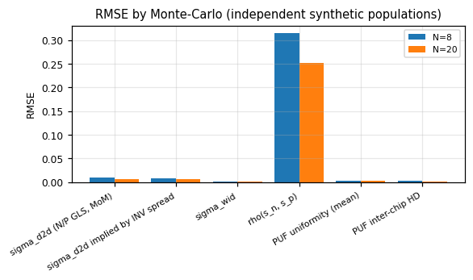
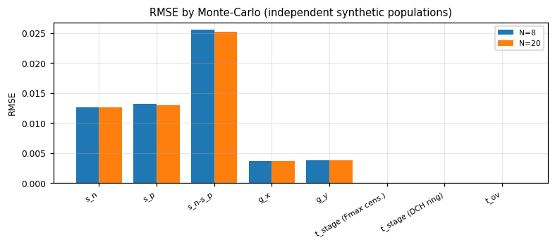
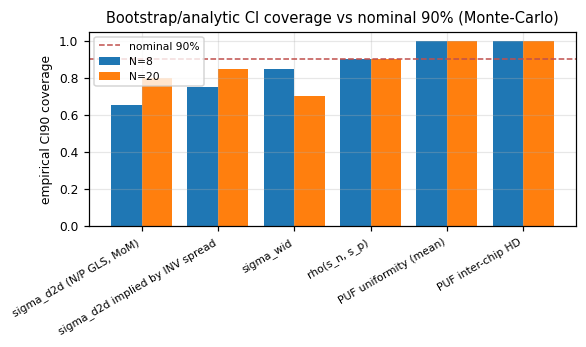
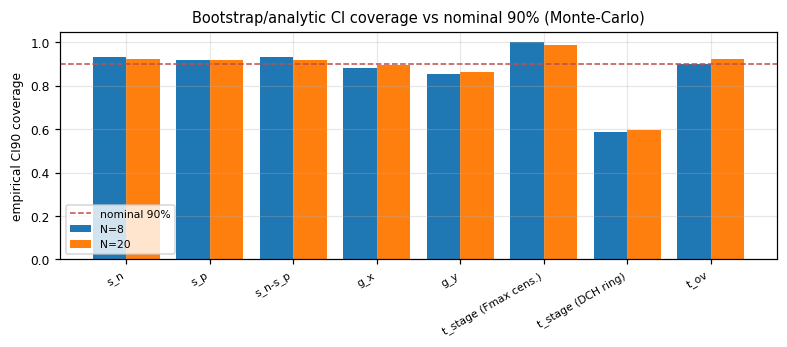
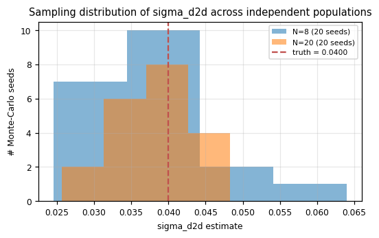

# BINNER estimator validation (Monte-Carlo)

Method: 20 independent synthetic populations per size (`analysis/synth_population.py`, distinct RNG seeds), N in [20, 8], analysed with `analysis/binner_analysis.py` (bootstrap B=400), compared against injected truth with `binner_analysis.validate_against_truth`. A single population's bootstrap CI answers 'how uncertain is this one estimate'; repeating the whole draw-and-estimate pipeline many times is what actually measures bias, RMSE and whether the stated CI has the coverage it claims.

## Population-level parameters (bias / RMSE / CI coverage over seeds)

| parameter | n | n_seeds | truth (typ.) | bias | rmse | rel. RMSE | CI90 coverage | n (CI obs) |
|---|---|---|---|---|---|---|---|---|
| PUF inter-chip HD | 8 | 20 | 0.5022 | 0.0008929 | 0.002232 | 0.004448 | 1 | 20 |
| PUF inter-chip HD | 20 | 20 | 0.5039 | 6.579e-05 | 0.0008058 | 0.001602 | 1 | 20 |
| PUF majority bits wrong vs noise-free (total) | 8 | 20 | 0 | 0.2 | 0.4472 | n/a | n/a | 0 |
| PUF majority bits wrong vs noise-free (total) | 20 | 20 | 0 | 0.5 | 0.7746 | n/a | n/a | 0 |
| PUF uniformity (mean) | 8 | 20 | 0.5039 | 0 | 0.003494 | 0.00748 | 1 | 20 |
| PUF uniformity (mean) | 20 | 20 | 0.5156 | -0.0003125 | 0.001976 | 0.004043 | 1 | 20 |
| rho(s_n, s_p) | 8 | 20 | 0 | -0.05302 | 0.3155 | n/a | 0.9 | 20 |
| rho(s_n, s_p) | 20 | 20 | 0 | 0.01263 | 0.2519 | n/a | 0.9 | 20 |
| sigma(ln f_INV) @25C | 8 | 20 | 0.02828 | -0.002646 | 0.00633 | 0.2238 | 0.65 | 20 |
| sigma(ln f_INV) @25C | 20 | 20 | 0.02828 | -0.001356 | 0.004261 | 0.1507 | 0.8 | 20 |
| sigma_d2d (N/P GLS, MoM) | 8 | 20 | 0.04 | -0.001876 | 0.008732 | 0.2183 | 0.65 | 20 |
| sigma_d2d (N/P GLS, MoM) | 20 | 20 | 0.04 | -0.001715 | 0.005419 | 0.1355 | 0.8 | 20 |
| sigma_d2d implied by INV spread | 8 | 20 | 0.04 | -0.001989 | 0.00863 | 0.2157 | 0.75 | 20 |
| sigma_d2d implied by INV spread | 20 | 20 | 0.04 | -0.001647 | 0.005433 | 0.1358 | 0.85 | 20 |
| sigma_wid | 8 | 20 | 0.008 | -0.0001558 | 0.000582 | 0.07276 | 0.85 | 20 |
| sigma_wid | 20 | 20 | 0.008 | -0.0001032 | 0.0003768 | 0.0471 | 0.7 | 20 |

## Per-chip parameters (pooled over all dies x seeds)

| parameter | n | n (dies x seeds) | n_seeds | bias | rmse | rel. RMSE | CI90 coverage | target pass rate |
|---|---|---|---|---|---|---|---|---|
| g_x | 8 | 160 | 20 | 0.0002197 | 0.003733 | 7.984 | 0.8812 | n/a |
| g_x | 20 | 400 | 20 | -3.813e-05 | 0.003654 | 8.828 | 0.895 | n/a |
| g_y | 8 | 160 | 20 | -0.0003461 | 0.003762 | 4.857 | 0.8562 | n/a |
| g_y | 20 | 400 | 20 | 0.0001457 | 0.003827 | 9.808 | 0.8625 | n/a |
| s_n | 8 | 160 | 20 | -0.0004598 | 0.01261 | 3.51 | 0.9313 | n/a |
| s_n | 20 | 400 | 20 | -5.334e-05 | 0.01258 | 3.238 | 0.925 | n/a |
| s_n+s_p | 8 | 160 | 20 | 0.0002069 | 0.003799 | 1.162 | 0.9313 | n/a |
| s_n+s_p | 20 | 400 | 20 | 0.0001271 | 0.004122 | 17.84 | 0.92 | n/a |
| s_n-s_p | 8 | 160 | 20 | -0.001126 | 0.02552 | 5.5 | 0.9313 | 0.275 |
| s_n-s_p | 20 | 400 | 20 | -0.0002338 | 0.02523 | 3.94 | 0.9175 | 0.2875 |
| s_p | 8 | 160 | 20 | 0.0006667 | 0.01319 | 3.657 | 0.9187 | n/a |
| s_p | 20 | 400 | 20 | 0.0001805 | 0.01298 | 3.72 | 0.92 | n/a |
| t_ov | 8 | 160 | 20 | 2.11e-11 | 4.281e-11 | 0.04767 | 0.9 | n/a |
| t_ov | 20 | 400 | 20 | 1.712e-11 | 4.065e-11 | 0.04521 | 0.9225 | n/a |
| t_stage (DCH ring) | 8 | 160 | 20 | 6.857e-14 | 2.391e-12 | 0.000697 | 0.5875 | 1 |
| t_stage (DCH ring) | 20 | 400 | 20 | 1.995e-13 | 2.384e-12 | 0.0006975 | 0.595 | 1 |
| t_stage (Fmax WLS mid) | 8 | 160 | 20 | -4.696e-13 | 3.871e-12 | 0.001128 | 0.975 | 1 |
| t_stage (Fmax WLS mid) | 20 | 400 | 20 | -2.178e-13 | 3.729e-12 | 0.001089 | 0.98 | 1 |
| t_stage (Fmax cens.) | 8 | 160 | 20 | -4.79e-13 | 3.811e-12 | 0.001111 | 1 | 1 |
| t_stage (Fmax cens.) | 20 | 400 | 20 | -1.978e-13 | 3.715e-12 | 0.001085 | 0.99 | 1 |

## Target reality check (docs/VARIATION_MODEL.md, N=20)

This script does not edit docs/VARIATION_MODEL.md. Where the achieved RMSE at N=20 exceeds the stated target, that is flagged here (and in the calling agent's final report) for a human to decide whether to relax the target, improve the estimator, or add more structures/repeats.

| parameter | target | achieved RMSE @N=20 | target_bound | status |
|---|---|---|---|---|
| sigma_d2d | +/-35% | 0.1358 | 0.35 | OK (within target) |
| sigma_wid | +/-25% | 0.0471 | 0.25 | OK (within target) |
| s_n - s_p (per die) | +/-0.01 | 0.02523 | 0.01 | MISSED |
| t_stage (per die) | +/-2% | 0.001085 | 0.02 | OK (within target) |

**Targets not met at N=20 by this Monte-Carlo:**

- `s_n - s_p (per die)`: target +/-0.01, achieved RMSE 0.02523 (bound 0.01). See docs/VARIATION_MODEL.md; this is reported, not silently patched.

## Degradation N=20 -> N=8

| parameter | rmse_N20 | rmse_N8 | ratio_N8_over_N20 | cov_N20 | cov_N8 |
|---|---|---|---|---|---|
| PUF inter-chip HD | 0.0008058 | 0.002232 | 2.77 | 1 | 1 |
| PUF majority bits wrong vs noise-free (total) | 0.7746 | 0.4472 | 0.5774 | n/a | n/a |
| PUF uniformity (mean) | 0.001976 | 0.003494 | 1.768 | 1 | 1 |
| rho(s_n, s_p) | 0.2519 | 0.3155 | 1.252 | 0.9 | 0.9 |
| sigma(ln f_INV) @25C | 0.004261 | 0.00633 | 1.485 | 0.8 | 0.65 |
| sigma_d2d (N/P GLS, MoM) | 0.005419 | 0.008732 | 1.611 | 0.8 | 0.65 |
| sigma_d2d implied by INV spread | 0.005433 | 0.00863 | 1.588 | 0.85 | 0.75 |
| sigma_wid | 0.0003768 | 0.000582 | 1.545 | 0.7 | 0.85 |

sqrt(20/8) = 1.58x is the naive sampling-noise expectation for RMSE inflation going from N=20 to N=8, if nothing else changed; ratios well above that point to additional small-N effects (e.g. REML/plane-fit degrees of freedom, bootstrap CI width blow-up, censored-fit robustness).

