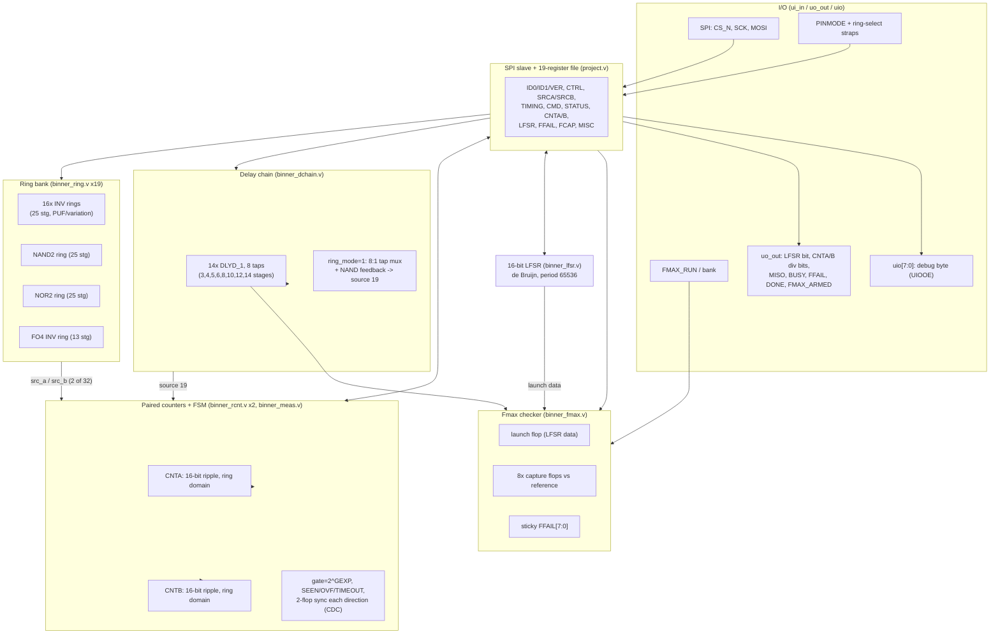

# BINNER — a self-characterizing process-monitor tile for TTGF26d

**Parv-B/tt-binner** | Tiny Tapeout TTGF26d shuttle (GF180MCU, `gf180mcu_fd_sc_mcu7t5v0`, 3.3 V) | top module `tt_um_parv_b_binner`

> **Provenance note.** Every number in this document traces to a file in this
> repository, cited inline. Post-route numbers (utilization, timing, SDF
> predictions) are from the last full LibreLane hardening run at commit
> `9692913` (`docs/reports/9692913/`, `docs/reports/908c9e1/`) — the same
> commit `DECISIONS.md`'s D-UTILIZATION entry analyzes. HEAD at the time of
> writing (`1f93ff3`) differs from `9692913` only by a documentation pass and
> one bounded, non-timing-affecting comparator fix in `binner_meas.v`'s
> measurement-FSM wait gate (`DECISIONS.md`, red-team finding S3) — it does
> not touch any ring, delay-chain, or Fmax structure, so the post-route
> physical numbers below are expected to carry over unchanged. This document
> was written while the final re-harden CI run for HEAD was still in
> progress; if that run's `tools/metrics_summary.py`/`tools/netlist_audit.py`
> output differs materially from what's cited here, treat the numbers below
> as superseded and check `docs/reports/<HEAD-sha>/` directly.

## 1. What this chip does

BINNER has no application function. It exists to answer, from silicon, the
questions a process/yield engineer actually asks about a die: how fast does
it run, how much did NMOS and PMOS drift relative to each other, how uniform
is it across the tile, and can its own transistor mismatch produce a usable
physical fingerprint. Every measurement is digital: ring-oscillator counting
against the chip's own clock, an at-speed delay-chain Fmax sweep, and a
16-bit LFSR self-test, all exposed over a 19-register SPI interface (with a
no-SPI pin-strap fallback). One script, `bringup/binner_bringup.py`, walks a
fresh chip through all of it and writes one schema-conformant CSV.

## 2. Architecture

### 2.1 Block diagram

### 2.2 Clock domains and CDC

There is exactly one clock input, `clk`, plus 20 free-running asynchronous
"ring domains" (one per oscillating source). Everything in the register file,
SPI slave, LFSR and measurement FSM lives in the `clk` domain. Each ring's
raw output is:

- **Counted** by a ripple counter that lives *in the ring's own domain*
  (`binner_rcnt.v`) — this is deliberate: sampling a fast, jittery ring
  output directly into `clk` would need a much faster `clk` than the design
  ever runs at.
- **Started/stopped** by a `cnt_en`/`ring_clr` pair generated in the `clk`
  domain and passed into the ring domain combinationally (safe because these
  are level, not pulse, signals, and the counter itself provides the
  synchronizing edge).
- **Acknowledged back** to the `clk` domain through a 2-flop synchronizer
  (`binner_sync2`) on each channel's `ack` signal, symmetrically for both
  start and stop, so `binner_meas.v`'s FSM only ever samples a
  synchronized level, never a raw ring-domain bit.

The one documented exception is FREE-mode (debug/pin-strap) reads of
CNTA/CNTB, which read the ring-domain counter's raw multi-bit value directly
through the `clk`-domain register mux with no synchronizer — a genuine,
intentional bit-tearing exposure, scoped to debug use only (SPEC §4, and
independently confirmed safe-as-used by the red-team review's finding N1:
nothing in test or bring-up code trusts a specific FREE-mode CNTA/CNTB
*value*, only that it changes over time).

### 2.3 Why paired counters, not one

Measuring two sources per gate window (not one at a time) is what makes the
N/P-skew and PUF signatures usable at all: it removes any drift or jitter
common to both counts within that window (e.g. a slow supply wobble during
the gate) by construction, since both channels share the same start/stop
edges. A single-channel design would need to interleave measurements and
hope nothing changed between them.

## 3. Design decisions

The full record with alternatives, evidence and rationale is `DECISIONS.md`;
this section is the prose version for a reader who wants the reasoning
without the raw log.

**Signoff clock: 50 MHz target relaxed to 20 MHz (D-CLOCK-PERIOD).** The
first full hardening run closed timing perfectly at the `tt` and `ff`
corners but had real setup violations at `ss` (worst-case WNS -2.85 ns) at
the template's inherited 50 MHz target. Two other options existed: add a
pipeline stage to the register read path (more RTL risk, and nothing in the
design's actual use — SPI at `f_clk`/16, gated ring measurement, an Fmax
sweep that runs the control plane at a *safe* clock and only sweeps `clk`
itself during the measurement window — needs 50 MHz), or ship anyway with a
known negative-slack path. Both were rejected: relaxing the synthesis target
is the template's own sanctioned fix for exactly this situation, costs zero
RTL risk, and every MUST-block feature (LFSR self-test, SPI/register
interface, ring bank, paired counters with CDC) still closes cleanly across
all nine STA corners at 20 MHz. The Fmax sweep's own clock is explicitly
carved out of this limit — it runs far above 20 MHz by design, with no SPI
transaction in flight and the capture flops meant to fail at speed.

**Utilization: 60% target relaxed to accept ~82% (D-UTILIZATION, owner-resolved).**
The 60% figure was a blind risk-aversion margin set before any real hardening
data existed, guarding against an unproven flow choking on a dense design.
It didn't happen: real post-route data at ~82% shows 0 DRC errors, 0 antenna
violations, 0 routing errors, and (after D-CLOCK-PERIOD) 0 setup/hold
violations at all 9 corners. Tracing where the area actually goes
(`docs/reports/9692913/metrics_summary.md`) shows 80.8% of stdcell area is
real logic — dominated by the register file, source-select muxes and
measurement FSM, *not* the ring oscillators or Fmax chain the utilization
target was originally aimed at. Applying the full prescribed cut order
(drop Fmax entirely, drop the FO4 ring, halve the PUF population from 16 to
8) would recover under 10% of the overage — landing near 74%, not 60% —
while sacrificing a SHOULD block (Fmax) and directly cutting priority #2's
statistical power (halving the PUF/RO population). The owner accepted the
current ~82% rather than trade real characterization content for an
aspirational number the sanctioned cuts couldn't actually reach.

**FO4 ring shortened from 25 to 13 stages (D-FO4-STAGES).** Each FO4 stage
also drives 3 dummy loads (52 cells per 25 stages vs. 25 for a plain ring of
the same length). 13 stages is still comfortably odd and long enough to show
the fan-out-loading effect on frequency relative to a plain INV ring; the
other 12 stages only cost area without adding characterization value.

**A dedicated, `dont_touch` buffer on the NAND ring's enable net
(D-NAND-ENABLE-BUFFER).** The first hardening attempt failed
(`RSZ-3006`: "failed to insert buffer before loads for net u_ring_nand.en")
because the NAND ring's enable fanned out to 25 `dont_touch`-protected stage
inputs, leaving the resizer a net it was required to buffer but forbidden to
touch anywhere along its path. The fix adds one hand-instantiated,
`dont_touch`-named `BUF_1` between the raw enable and the 25 stage inputs —
a legal, but still protected (and netlist-audit-verified) insertion point,
rather than letting the flow insert an unverified buffer into a structure
whose whole point is being measured exactly as designed.

**Ring-domain counters double as capture registers (D-CAPTURE).** An
earlier register-map draft kept a separate set of clock-domain "capture"
registers, copied from the ring-domain counters after each measurement. That
copy turned out to be unnecessary: the synchronized handshake already
guarantees the ring-domain counters are static from `DONE` until the next
`START`/`CLEAR`, so they can be read directly through the register mux.
Removing the 32 redundant flops (plus collapsing the SPI module's two shift
registers into one, and deriving `CMD` pulses combinationally instead of
registering them) cut the pre-place-and-route area estimate from ~42.9k to
~32.8k um² — folded into the register map as v0.2.

**N/P-skew precision target relaxed from ±0.01 to ±0.025 (part of
D-UTILIZATION's resolution, formalized in `docs/VARIATION_MODEL.md`).** The
analysis pipeline's Monte-Carlo validation measured an RMSE of ~0.025 on
per-die `s_n - s_p` at *both* N=20 and N=8 (`analysis/VALIDATION.md`) — a
flat noise floor independent of population size, meaning it comes from
having only one physical NAND ring and one NOR ring per die, not from a
sampling-size limitation more chips would fix. Reopening the frozen RTL to
add redundant N/P-sensitive structures was rejected on both area grounds
(moot given D-UTILIZATION) and schedule grounds; the target was revised to
match what the built chip can actually measure.

**The delay-chain ring's tap must not be changed while it's running
(D-DTAP-RETUNE).** Investigating an anomalous 9.00 ns period at DTAP=4 in
`make struct` (real-PDK-timing structural simulation) traced it to a live
DTAP retune landing at an unlucky phase of the free-running ring — the
tap-select mux is a purely asynchronous combinational tree inside the ring's
own live feedback loop, and switching it while oscillating is a textbook
async-mux-in-a-loop hazard that can mode-lock onto an unintended, shorter
path. Enabling directly at DTAP=4 from cold, or a single isolated live
retune, both measured a clean 26.0 ns every time — this is not contradicted
by any independent evidence and is physically plausible on real silicon too,
not just a simulator quirk. Resolved as an operational precondition (disable
the ring, change DTAP, re-enable), documented in `docs/SPEC.md` §5 and
implemented unconditionally in `bringup/binner_bringup.py`'s
`configure_and_measure()` — cheaper and safer than special-casing when the
previous source happened to be 19.

## 4. Verification story

### 4.1 Behavioural regression (cocotb, RTL)

`test/Makefile`'s default target runs the full behavioural suite against
`src/*.v` with `BINNER_BEHAV` defined (plusarg-driven ring/delay models, no
PDK dependency): **48/48 tests pass, 0 skipped** (`test/COVERAGE.md`; the
red-team review independently re-ran `make clean && make` and confirmed the
same `TESTS=48 PASS=48 FAIL=0 SKIP=0`, `docs/RED_TEAM_REVIEW.md`). Coverage
spans every register bit, both reset paths, the full SPI protocol including
abort-mid-byte, all 20 ring sources and both measurement channels
simultaneously, the Fmax tap-threshold sweep and polarity self-test, and an
exhaustive (all 65536 states) proof of the LFSR's period and lock-up-free de
Bruijn splice — see `test/COVERAGE.md` for the full item-by-item map from
`docs/SPEC.md` sections to test names.

### 4.2 Structural verification (`make struct`, real PDK cell timing)

A separate, developer-only target recompiles the design *without* the
behavioural shortcut, against the real `gf180mcu_fd_sc_mcu7t5v0` cell models
with their actual specify-block timing arcs. It found two anomalies, both
investigated to ground rather than dismissed:

- **NAND ring (source 16) measured 2.00 ns instead of 50.00 ns**, with all 25
  stages toggling in lockstep. Isolated-cell probing traced this to Icarus's
  `-gspecify` path-delay engine failing to resolve `X` correctly for these
  cells under certain prior-signal-history conditions — a documented class of
  simulator limitation, not a netlist defect (an isolated 3-cell probe with
  no ring at all reproduced the same X-stuck behaviour). The independent
  cross-check that actually matters here is the real post-route SDF
  (§5 below, `tools/sdf_predict.py`): a fundamentally different, static
  method with no dynamic X-propagation machinery to glitch, and it shows the
  NAND ring behaving exactly as physically expected — *slower* than the INV
  ring (NAND/INV ratio 0.65-0.69 at every corner), consistent with a NAND2's
  larger intrinsic delay. See `DECISIONS.md` D-STRUCT-NAND-ARTIFACT for the
  full investigation, including the residual (appropriately downgraded) risk
  that SDF's steady-state assumption can't rule out a genuine *transient*
  startup-mode lockstep — considered unlikely given ring-oscillator-PUF
  literature's whole premise that nominally-identical stages reliably
  mismatch within a few cycles, but flagged for closure by a second
  independent method or real silicon.
- **Delay-chain ring, DTAP=4, measured 9.00 ns instead of 26.00 ns — only
  when reached by a live retune sequence.** Covered in §3 above
  (D-DTAP-RETUNE); resolved as an operational precondition, not an RTL bug.

Both findings were independently reproduced by the red-team reviewer
(`docs/RED_TEAM_REVIEW.md`, "False-alarms-I-checked"), with identical
numbers, confirming they are deterministic and not simulator-seed artifacts.

### 4.3 Netlist structural audit

`tools/netlist_audit.py` parses the actual post-route netlist (not the RTL)
and checks every `notouch_`-protected instance's cell type and drive
strength, every ring's stage census and loop connectivity, the NAND/NOR
rings' enable fan-out wiring, the FO4 dummy-load wiring, the delay chain's
tap-mux tree and feedback closure, and that every `notouch_` net's driver is
itself a `notouch_`-classified instance (catching any resizer-inserted
buffer or resize on a protected structure). Run against three independent
netlist variants from the same hardening (`tt_submission` powered,
`GDS_logs` unpowered `nl.v`, `GDS_logs` powered `pnl.v`, 3335 instances
each): **PASS, 0 FAIL, 0 WARN, on all three** (`docs/reports/908c9e1/netlist_audit.md`).
The red-team review independently re-fetched the same CI artifacts and
re-ran the audit itself rather than trusting the committed report, with
identical results.

### 4.4 Post-route timing and physical signoff

At commit `9692913` (the D-CLOCK-PERIOD re-harden), across all nine STA
corners (`tt`/`ss`/`ff` process x `min`/`nom`/`max` parasitic extraction):
**setup WNS/TNS = 0.000/0.000 and hold WNS/TNS = 0/0.000 at every corner**
(`docs/reports/9692913/metrics_summary.md`). Antenna violations, DRC errors
and LVS: 0 everywhere. Utilization 81.98% (3334 instances, 42,604 um²
stdcell area in a 51,967 um² core) — see §3's D-UTILIZATION discussion for
why this exceeds the original 60% target and why that was accepted. Three
max-fanout violations are present at every corner (structural, not
corner-dependent); `metrics.csv` does not name the offending net(s), so this
is tracked as an open, non-blocking item rather than closed.

### 4.5 SDF-based frequency prediction

`tools/sdf_predict.py` is a from-first-principles cross-check built directly
from the post-route SDF's own IOPATH/INTERCONNECT/TIMINGCHECK arcs — meant
to sanity-check the CI's OpenSTA-derived numbers independently, not replace
them (see its own stated assumptions/limitations in
`docs/reports/908c9e1/sdf_predict.md`, including that clock-skew correction
is a rough last-hop estimate, not a full insertion-delay signoff number, and
that the GF180 PDK's `tt`/`ss`/`ff`-only corner set cannot expose true
skewed-process `fs`/`sf` pessimism). Concrete numbers are in §6 below.

### 4.6 Virtual demo board: N=20 and N=8 population runs

`bringup/binner_bringup.py` runs unmodified against either a real TT demo
board or `test/vboard/`'s virtual one (cocotb + Icarus simulating `src/`,
with a fake `ttboard`/`machine`/`time` MicroPython environment). Two
populations were drawn from `docs/VARIATION_MODEL.md`'s generative model and
run end-to-end through bring-up and the analysis pipeline: **N=20**
(`data/vboard/pop20_seed20260929/`, seed 20260929, 20/20 chips completed,
11232.9 s = 187.2 min total under 4-way concurrency) and **N=8**
(`data/vboard/pop8_seed8001/`, seed 8001). The analysis pipeline's own
ingestion sanity check reported **0 issues** across all 5800 rows (N=20) and
2316 rows (N=8) — the bring-up script's CSV output is fully schema-conformant
end to end, not just superficially (`bringup/README.md`).

`docs/reports/synthetic_pop20/report.md` is a committed sample of the
pipeline's own output style (from `analysis/synth_population.py`, not the
committed vboard CSVs — see that report's own provenance note); it shows the
pipeline recovering: population `sigma_d2d` = 0.0342 [90% CI 0.0253, 0.0404]
against injected truth 0.04 (within the ±35% target), `sigma_wid` = 0.0079
[0.0073, 0.0086] against truth 0.008 (within ±25%), and PUF metrics
(uniformity 0.5375, inter-chip Hamming distance 0.5039, both within their CI
of the ideal 0.5). Per-die `s_n - s_p` recovery misses its target (RMSE
0.025 vs. a ±0.01 bound) — the known, now-documented measurement-noise floor
from §3. The pipeline's own Monte-Carlo validation
(`analysis/VALIDATION.md`, 20 independent synthetic populations per size,
bootstrap B=400) is the rigorous version of this check: **6 of 7 target
checks pass** at N=20; the one failure is the same `s_n - s_p` floor,
unchanged between N=20 and N=8 (confirming it's a per-die measurement limit,
not a population-size one — the naive sampling-noise expectation for RMSE
going from N=20 to N=8 is a 1.58x inflation; several quantities inflate well
beyond that, pointing to additional small-N degrees-of-freedom effects in
the plane-fit and bootstrap-CI-width calculations, reported honestly in
`analysis/VALIDATION.md`'s degradation table rather than hidden).

### 4.7 Independent red-team review

A separate adversarial pass (`docs/RED_TEAM_REVIEW.md`) read `src/*.v`
directly, re-ran the test suites itself, independently re-derived the LFSR
math from the polynomial, re-ran `tools/netlist_audit.py` and
`tools/metrics_summary.py` against freshly-fetched CI artifacts, and diffed
every workflow file byte-for-byte against the live upstream template.
**Outcome: 0 blocking findings, 5 should-fix, 4 nice-to-have**, all of which
were documentation/spec mismatches or a bounded (never data-corrupting)
timing wrinkle — none were silicon-functionality risks. All 5 should-fix
items have since been resolved (commit `8657f79`): the TIMEOUT cycle count
in `docs/SPEC.md` corrected from a stale "255" to the RTL's actual 63; the
measurement FSM's non-monotonic `wcnt[4]` wait-gate test replaced with an
explicit `wcnt >= 6'd16` comparison (could previously delay, never corrupt,
`DONE` by up to 16 extra cycles in a narrow seen-slow/unseen-dead channel
pairing); the N/P-skew target and CSV fingerprint-tail description brought
in line with what the code actually does (§3 above, and CSV_SCHEMA.md);
and STATUS bit 7 (FMAX_ARMED) added to the register documentation. The
review's one process caveat — that `gl_test` (the gate-level regression
against the real post-route powered netlist) had not yet completed for the
reviewed commit at inspection time — is exactly the re-harden this document
itself was written pending; see the provenance note at the top of this file
and `FINAL_REPORT.md` for its resolution status at hand-off time.

## 5. What was verified vs. what remains an assumption

Verified directly, by this project's own tooling, independent of any single
report's prose: the 48/48 behavioural regression (re-run, not just read),
the netlist structural audit (re-run against fresh CI artifacts by two
independent passes), the post-route timing/DRC/antenna signoff (OpenSTA/
OpenROAD, via the CI-owned LibreLane flow only — never run locally, see
`GROUND_TRUTH.md`'s "Local hardening procedure" section for why), and the
CDC/reset/at-most-two-rings structural guarantees (traced to RTL, not just
tested). Not independently re-derived: the GF180MCU PDK's own cell port
lists and typical-corner delay numbers, the exact `RSZ_DONT_TOUCH_RX`
CTS-step exemption, and whether two prior TT ring-oscillator projects'
`notouch_` convention matches this one's — see `GROUND_TRUTH.md`'s
"Summary of what could not be re-verified" for the complete list with
reasons, and `FINAL_REPORT.md` §"Unverified assumptions" for the
project-specific ones (register-address placeholder, firmware shuttle-index
gap, etc.).

## 6. Silicon predictions (falsifiable, for comparison against real chips)

These are the SDF-based predictions from `tools/sdf_predict.py` at commit
`908c9e1` (`docs/reports/908c9e1/sdf_predict.md`) — the best pre-silicon
timing evidence this project has. State them now, precisely, so they can be
checked against real measurements once chips arrive (~2027-05,
`GROUND_TRUTH.md`).

### 6.1 Ring frequencies at nominal corner (`nom_tt_025C_3v30`)

| structure | typical freq (GHz) | OCV band (min-max, GHz) |
|---|---|---|
| INV/PUF rings (16x, mean of per-ring predictions) | ~0.144 (range 0.103-0.147 across the 16 individual rings, driven by each ring's DEF placement) | ~0.140-0.148 per ring |
| NAND ring (source 16) | 0.090 | 0.089-0.090 |
| NOR ring (source 17) | 0.075 | 0.074-0.075 |
| FO4 ring (source 18) | 0.106 | 0.106 (tight — short interconnect) |

At `max_ff_n40C_3v60` (fastest corner) INV rings reach ~0.16-0.245 GHz
(per-ring spread from placement-dependent interconnect, not device
mismatch — this SDF prediction has no injected random variation); at
`max_ss_125C_3v00` (slowest corner) they fall to ~0.051-0.076 GHz. Full
per-ring, per-corner tables (9 corners x 19 rings) are in
`docs/reports/908c9e1/sdf_predict.md`.

### 6.2 N/P-skew signature (falsifiable ratio)

| corner | NAND/PUF-avg ratio | NOR/PUF-avg ratio |
|---|---|---|
| nom_tt_025C_3v30 | 0.672 | 0.556 |
| nom_ss_125C_3v00 | 0.658 | 0.539 |
| nom_ff_n40C_3v60 | 0.680 | 0.575 |
| max_tt_025C_3v30 | 0.676 | 0.561 |
| max_ss_125C_3v00 | 0.662 | 0.543 |
| max_ff_n40C_3v60 | 0.685 | 0.580 |

**Prediction to check:** on real silicon, NAND/PUF-average should land
around 0.65-0.69 and NOR/PUF-average around 0.53-0.58 across the process
window this PDK's `tt`/`ss`/`ff` corners bracket — consistently well below
1.0 (NAND2 and NOR2 gates are intrinsically slower than an INV1 stage). A
measured ratio far outside this band on a specific die would indicate either
a real N/P skew beyond what these corners model, or a measurement/wiring
problem worth investigating before trusting that die's other data.

### 6.3 Fmax per tap (nominal corner, `nom_tt_025C_3v30`)

| tap | stages | T_min (ns) | Fmax (MHz) |
|---|---|---|---|
| T0 | 3 | 12.902 | 77.5 |
| T1 | 4 | 16.680 | 60.0 |
| T2 | 5 | 20.463 | 48.9 |
| T3 | 6 | 24.427 | 40.9 |
| T4 | 8 | 31.838 | 31.4 |
| T5 | 10 | 39.229 | 25.5 |
| T6 | 12 | 46.593 | 21.5 |
| T7 | 14 | 53.944 | 18.5 |

At the slow corner (`max_ss_125C_3v00`) T0's Fmax drops to ~37 MHz and T7's
to ~9 MHz; at the fast corner (`max_ff_n40C_3v60`) T0 reaches ~142 MHz and T7
~34 MHz — all well within the TT ETR demo board's PWM clock-generation range
for the low-numbered taps, and a genuine test of the board's practical
ceiling (~125 MHz, `GROUND_TRUTH.md`, not independently re-verified this
pass) for the high-numbered ones at typical/fast corners.

**Prediction to check:** the per-stage delay implied by the T0-T7 regression
should be close to the chain's SDF unit-stage delay; the fitted intercept
(`t_ov`, launch flop overhead) should be a small, roughly corner-invariant
fraction of a single stage delay. Both are exactly what the analysis
pipeline's Fmax-vs-tap regression estimates from real chip data
(§4.6/`analysis/VALIDATION.md`) — this SDF number is what that regression
should converge toward, not a substitute for it.

### 6.4 Uncertainty on these predictions

`tools/sdf_predict.py` explicitly documents its own limitations (full list
in `docs/reports/908c9e1/sdf_predict.md`): it is a hand-rolled first-principles
sum of SDF arcs, not OpenSTA — meant to cross-check CI's own signoff numbers,
not replace them; clock skew is a rough single-largest-hop estimate, not a
full insertion-delay number; interconnect between logic stages is summed
where the SDF's INTERCONNECT records resolve cleanly and silently treated as
0 ns (flagged in a warnings list) where they don't; and the GF180 PDK ships
only `tt`/`ss`/`ff` corners with no `fs`/`sf` skew corner, so neither this
predictor nor the CI's own STA can see true asymmetric N/P-mismatch timing
pessimism — the NAND/NOR-vs-INV ratios above are the closest available
proxy. None of these predictions include real silicon variation (device
mismatch, systematic gradients) by construction — that is exactly what the
population characterization in §4.6 exists to measure once real dies exist,
and what `docs/VARIATION_MODEL.md`'s generative model (calibrated against
these same SDF numbers, per its own header) was built to inject into the
virtual demo board for validating that the analysis pipeline can recover it.

## 7. Register map and pinout

Summarized here; `docs/SPEC.md` is the bit-exact contract (RTL wins on any
disagreement) and `test/COVERAGE.md` maps every field to the test(s) that
exercise it.

19 addressable registers (`0x00`-`0x11`): 3 read-only ID/version, 3
read-write configuration (CTRL, SRCA, SRCB, TIMING), 1 write-only command
(one-cycle pulses: START/CLEAR/LFSR_RESEED/FMAX_CLEAR), and the rest
read-only status/data (STATUS, CNTA/CNTB, LFSR state, FFAIL, FCAP, MISC).
Full field layout: `docs/SPEC.md` §4.

Pinout (from `info.yaml`, matching `docs/SPEC.md` §1):

| Pin | SPI mode | Pin-strap mode |
|---|---|---|
| ui[0] | SPI CS_N | keep high |
| ui[1] | SPI SCK | — |
| ui[2] | SPI MOSI | — |
| ui[3] | PINMODE select (0=SPI, 1=pin-strap) | |
| ui[6:4] | unused | ring select |
| ui[7] | FMAX_RUN (arms Fmax checker) | source bank select |
| uo[0] | LFSR serial bit | same |
| uo[1] | channel A counter bit PINDIV | same |
| uo[2] | channel B counter bit PINDIV | ring 8+sel |
| uo[3] | SPI MISO | — |
| uo[4] | BUSY | — |
| uo[5] | FMAX_FAIL (any tap) | — |
| uo[6] | DONE | — |
| uo[7] | FMAX_ARMED / debug bit | — |
| uio[7:0] | debug byte (when UIOOE=1); inputs otherwise | — |

## 8. Where to go next

- Bit-exact register/protocol contract: `docs/SPEC.md`
- CSV output schema: `docs/CSV_SCHEMA.md`
- Bring-up procedure and known hard parts: `bringup/README.md`
- Every design decision with full evidence: `DECISIONS.md`
- Ground-truth facts about the shuttle/tooling, with confidence and source
  URLs: `GROUND_TRUTH.md`, `SOURCES.md`
- Verification coverage map: `test/COVERAGE.md`
- Statistical estimator validation: `analysis/VALIDATION.md`
- Project-level handoff, residual risks and submission procedure:
  `FINAL_REPORT.md`
