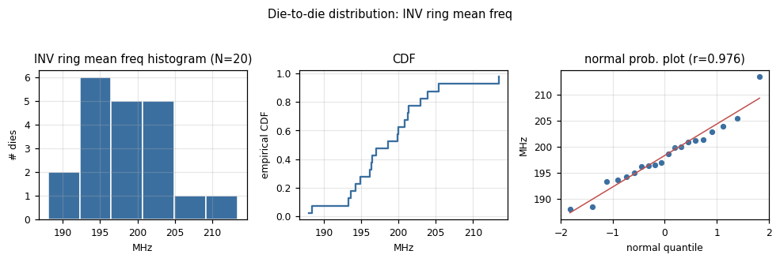
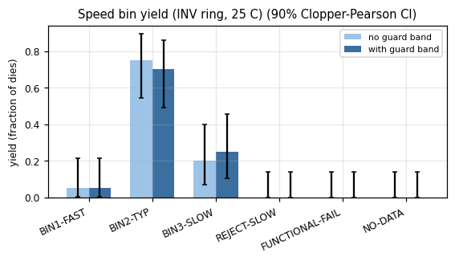
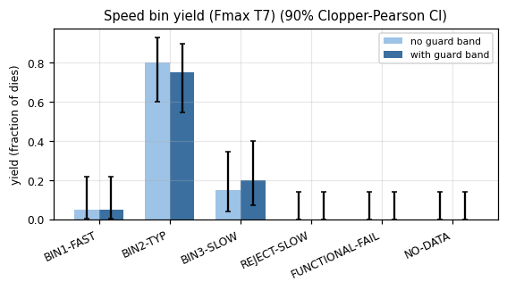
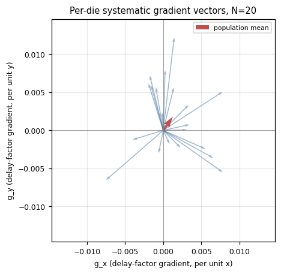
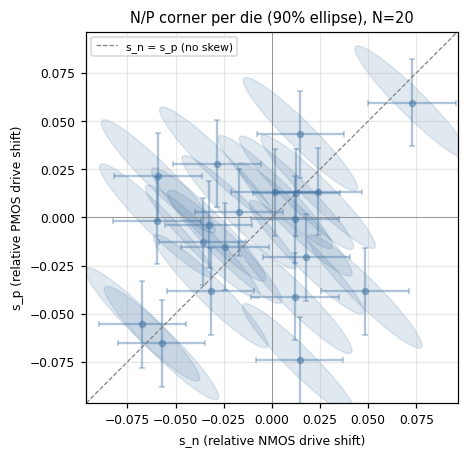
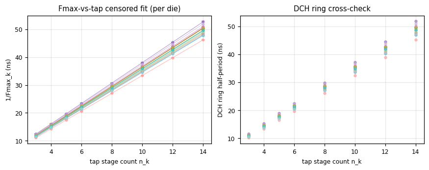
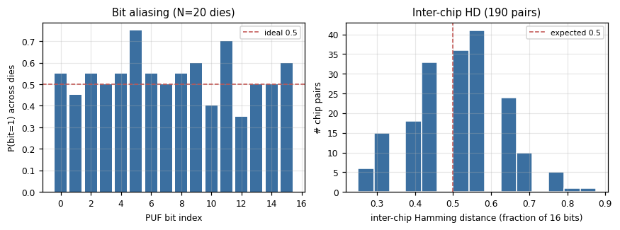
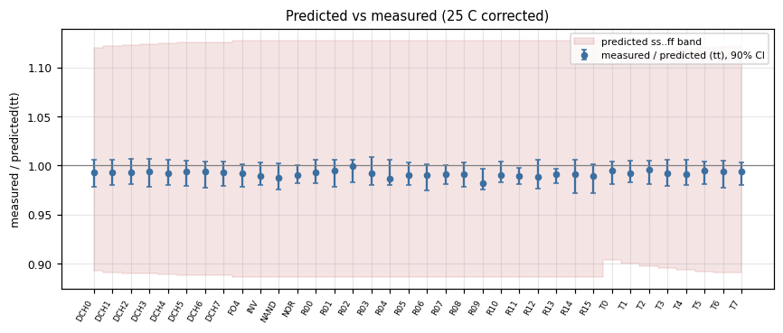

# BINNER bring-up population report

Source CSVs: `C:/Users/parvb/AppData/Local/Temp/binner_synth20` &mdash; 20 chip(s): sim00, sim01, sim02, sim03, sim04, sim05, sim06, sim07, sim08, sim09, sim10, sim11, sim12, sim13, sim14, sim15, sim16, sim17, sim18, sim19

Generated by `analysis/run_analysis.py` (BINNER TTGF26d analysis pipeline). All frequencies are ring/tap oscillation frequencies in MHz unless noted; delays in ns or ps; process shifts (s_n, s_p, gradients) are dimensionless relative deltas. Every population estimate reports a 90% two-sided confidence interval, either a nonparametric chip-level bootstrap (the chip/die is the independent resampling unit -- rings within a chip are correlated, not independent draws of the die-to-die process) or, where noted, an exact normal-theory chi-square interval for a standard deviation.

> **Placement notice:** PLACEHOLDER placement used (4x4 INV grid); gradient estimates are only meaningful once tools/place_extract.py output is supplied

## a. Ingestion, schema validation and completeness

Screening rules applied (docs/CSV_SCHEMA.md flags; see `binner_analysis.SCREEN_RULES` for exact thresholds):

- **R1**: Rows flagged OVF, NOSEEN or TIMEOUT are invalid (counter wrapped / source dead / handshake failed) and never used.
- **R2**: Ring rows with y <= 0, non-finite y, or y outside [1/3, 3] x the nominal model frequency are invalid (implausible).
- **R3**: SUSPECT rows are used only if no unflagged repeat of the same (chip, stage, test, item) exists.
- **R4**: Repeat screen: within a (chip, stage, item) ring group with >= 3 valid repeats, a value deviating from the group median by more than max(6 x 1.4826 x MAD, 0.5 %) is rejected.
- **R5**: Within-die screen: an INV ring whose residual from the per-chip plane fit exceeds 5 x the pooled within-die sigma is excluded from the gradient / sigma_wid fits (reported as a ring outlier - in production this is a defect signature).
- **R6**: Chip screen: a chip whose mean INV ln f has a robust z-score (median/MAD over chips) > 4 is flagged a population outlier; it stays in yield counts but population sigma is reported with and without it.
- **R7**: A chip failing any Stage 1 functional check (ID, register read-back, LFSR known-answer, CLK2 count +/-1) is binned FUNCTIONAL-FAIL; its parametric data are still analysed (a digital defect does not invalidate a ring frequency).

20 file(s) read, 0 schema ERROR(s), 0 WARNING(s).

### Per-chip completeness

| chip | stages | functional | INV rings | NAND/NOR/FO4 | DCH taps | Fmax taps | PUF bits | PUF reps | Stage5 | temp | rows | invalid rows | flags |
|---|---|---|---|---|---|---|---|---|---|---|---|---|---|
| sim00 | 12345 | PASS | 16/16 | YYY | 8/8 | 8/8 | 16/16 | 11 | Y | Y | 849 | 0 | PINMODE |
| sim01 | 12345 | PASS | 16/16 | YYY | 8/8 | 8/8 | 16/16 | 11 | Y | Y | 849 | 0 | PINMODE |
| sim02 | 12345 | PASS | 16/16 | YYY | 8/8 | 8/8 | 16/16 | 11 | Y | Y | 849 | 0 | PINMODE |
| sim03 | 12345 | PASS | 16/16 | YYY | 8/8 | 8/8 | 16/16 | 11 | Y | Y | 849 | 0 | PINMODE |
| sim04 | 12345 | PASS | 16/16 | YYY | 8/8 | 8/8 | 16/16 | 11 | Y | Y | 854 | 0 | PINMODE |
| sim05 | 12345 | PASS | 16/16 | YYY | 8/8 | 8/8 | 16/16 | 11 | Y | Y | 851 | 0 | PINMODE |
| sim06 | 12345 | PASS | 16/16 | YYY | 8/8 | 8/8 | 16/16 | 11 | Y | Y | 849 | 0 | PINMODE |
| sim07 | 12345 | PASS | 16/16 | YYY | 8/8 | 8/8 | 16/16 | 11 | Y | Y | 847 | 0 | PINMODE |
| sim08 | 12345 | PASS | 16/16 | YYY | 8/8 | 8/8 | 16/16 | 11 | Y | Y | 847 | 0 | PINMODE |
| sim09 | 12345 | PASS | 16/16 | YYY | 8/8 | 8/8 | 16/16 | 11 | Y | Y | 847 | 0 | PINMODE |
| sim10 | 12345 | PASS | 16/16 | YYY | 8/8 | 8/8 | 16/16 | 11 | Y | Y | 850 | 0 | PINMODE |
| sim11 | 12345 | PASS | 16/16 | YYY | 8/8 | 8/8 | 16/16 | 11 | Y | Y | 849 | 0 | PINMODE |
| sim12 | 12345 | PASS | 16/16 | YYY | 8/8 | 8/8 | 16/16 | 11 | Y | Y | 851 | 0 | PINMODE |
| sim13 | 12345 | PASS | 16/16 | YYY | 8/8 | 8/8 | 16/16 | 11 | Y | Y | 851 | 0 | PINMODE |
| sim14 | 12345 | PASS | 16/16 | YYY | 8/8 | 8/8 | 16/16 | 11 | Y | Y | 851 | 0 | PINMODE |
| sim15 | 12345 | PASS | 16/16 | YYY | 8/8 | 8/8 | 16/16 | 11 | Y | Y | 851 | 0 | PINMODE |
| sim16 | 12345 | PASS | 16/16 | YYY | 8/8 | 8/8 | 16/16 | 11 | Y | Y | 851 | 0 | PINMODE |
| sim17 | 12345 | PASS | 16/16 | YYY | 8/8 | 8/8 | 16/16 | 11 | Y | Y | 853 | 0 | PINMODE |
| sim18 | 12345 | PASS | 16/16 | YYY | 8/8 | 8/8 | 16/16 | 11 | Y | Y | 855 | 0 | PINMODE |
| sim19 | 12345 | PASS | 16/16 | YYY | 8/8 | 8/8 | 16/16 | 11 | Y | Y | 850 | 0 | PINMODE |

## b. Die-to-die distributions

Per-chip mean frequency of each structure type, and derived per-stage propagation delay tpd = 1/(2 * stages * f). Distributions are summarised on ln(f) because process variation is closer to multiplicative than additive; `rel_sd` below is the 1-sigma relative (fractional) spread.

| chip | n_inv | f_inv_MHz | f_nand_MHz | f_nor_MHz | f_fo4_MHz | tpd_inv_ps | temp_c |
|---|---|---|---|---|---|---|---|
| sim00 | 16 | 204.5 | 150.3 | 126.2 | 171.6 | 97.78 | 22.92 |
| sim01 | 16 | 201 | 149.4 | 125 | 168.5 | 99.48 | 25.63 |
| sim02 | 16 | 193.5 | 142.8 | 123.6 | 159.6 | 103.3 | 25.16 |
| sim03 | 16 | 201.1 | 151.3 | 122.8 | 169.8 | 99.43 | 24.09 |
| sim04 | 16 | 196.4 | 141.6 | 123.7 | 160.2 | 101.9 | 25.55 |
| sim05 | 16 | 200.6 | 145.2 | 126.3 | 166.5 | 99.68 | 22.88 |
| sim06 | 16 | 194.6 | 143.1 | 122.8 | 165.9 | 102.8 | 26.27 |
| sim07 | 16 | 213 | 159 | 132.9 | 178.4 | 93.91 | 26.43 |
| sim08 | 16 | 185.5 | 137.4 | 115.5 | 154.7 | 107.8 | 33.84 |
| sim09 | 16 | 189.1 | 138.3 | 117.3 | 157.1 | 105.7 | 22.3 |
| sim10 | 16 | 194.4 | 146.2 | 118.6 | 162.7 | 102.9 | 24.45 |
| sim11 | 16 | 203.9 | 149.2 | 126 | 168.3 | 98.08 | 21.74 |
| sim12 | 16 | 192.2 | 141.7 | 118.8 | 160 | 104.1 | 28.77 |
| sim13 | 16 | 194.7 | 144.7 | 123.5 | 166 | 102.7 | 29.87 |
| sim14 | 16 | 194.4 | 143.6 | 121.5 | 162.1 | 102.9 | 31.56 |
| sim15 | 16 | 198.3 | 146.3 | 124.5 | 163.9 | 100.8 | 26.11 |
| sim16 | 16 | 194.7 | 146.2 | 120.1 | 162.8 | 102.7 | 32.94 |
| sim17 | 16 | 197.9 | 146.6 | 121.5 | 164.2 | 101.1 | 31.78 |
| sim18 | 16 | 198.3 | 148 | 125.2 | 168.3 | 100.8 | 35.33 |
| sim19 | 16 | 205 | 154.1 | 130.9 | 172.5 | 97.54 | 26.1 |

*INV ring mean frequency: histogram, CDF, normal-probability plot*

### Population summary (bootstrap 90% CI)

| quantity | n | mean | sd | sd_ci90 | rel_sd | rel_sd_ci90 | shapiro_p |
|---|---|---|---|---|---|---|---|
| INV ring (mean of 16) | 20 | 1.977e+08 | 6.182e+06 | [4.183e+06, 7.769e+06] | 0.03111 | [0.021, 0.03883] | 0.7161 |
| INV ring @25C | 20 | 1.983e+08 | 5.877e+06 | [3.874e+06, 7.448e+06] | 0.02948 | [0.01992, 0.03678] | 0.6177 |
| NAND ring | 20 | 1.463e+08 | 5.152e+06 | [3.462e+06, 6.441e+06] | 0.03497 | [0.0234, 0.04313] | 0.7931 |
| NOR ring | 20 | 1.233e+08 | 4.229e+06 | [2.972e+06, 5.151e+06] | 0.03416 | [0.0235, 0.04276] | 0.7333 |
| FO4 ring | 20 | 1.652e+08 | 5.642e+06 | [3.922e+06, 6.845e+06] | 0.03403 | [0.02414, 0.04161] | 0.9917 |
| chain stage delay (Fmax fit) | 20 | 3.438e-09 | 1.076e-10 | [7.415e-11, 1.338e-10] | 0.03144 | [0.02056, 0.03935] | 0.9102 |
| chain stage delay (DCH ring) | 20 | 3.438e-09 | 1.073e-10 | [7.432e-11, 1.332e-10] | 0.03138 | [0.02134, 0.03884] | 0.8661 |
| Fmax overhead t_ov | 20 | 9.037e-10 | 4.198e-11 | [3.124e-11, 5.003e-11] | 0.04683 | [0.035, 0.05495] | 0.8493 |
| Fmax T7 | 20 | 2.013e+07 | 6.137e+05 | [4.102e+05, 7.566e+05] | 0.03036 | [0.02052, 0.03768] | 0.7795 |

sigma(ln f_INV) @25C = **0.02948** [0.02002, 0.03667] (90% CI, N=20); implied sigma_d2d (correcting for rho=0.502 between s_n, s_p) = **0.03401** [0.0231, 0.04232].

## c. Speed-bin definitions and gauge R&R

**Gauge R&R** (repeatability & reproducibility) on the bin metric, following the standard %GRR / ndc (number of distinct categories) convention: `sigma_repeat` = pooled within-die sd of the metric across repeat passes, `sigma_part` = between-die sd corrected for repeatability, `%GRR = 100*sigma_measurement/sigma_total`, `ndc = 1.41*sigma_part/sigma_measurement` (floor(ndc) categories can be reliably distinguished; AIAG guidance: ndc >= 5 good, %GRR < 10% good, 10-30% marginal, > 30% unacceptable).

**Metric:** mean INV ring ln f, 20 dies x 3.0 repeat pass(es) avg.

| component set | sigma_measurement | sigma_part | %GRR | ndc |
|---|---|---|---|---|
| gauge | 7.672e-05 | 0.03112 | 0.2466 | 571 |
| gauge+temp | 0.001502 | 0.03112 | 4.821 | 29 |

`gauge` = repeatability alone (same-session repeats); `gauge+temp` additionally folds in the temperature-proxy correction uncertainty (a Type-B term invisible to same-session repeats, from `temp_coeff_per_C * temp_proxy_sigma_C`).

**Metric:** Fmax T7 ln f -- sigma_measurement = max(observed repeat sd, PWM-quantisation floor) = **0.0008326**; %GRR = 2.743%, ndc = 51. Because two repeats of the same tap with the same PWM grid can return literally the same reading, `sigma_quant = step/sqrt(12)` floors the estimate; the reported sigma_measurement is `max(observed, quant)`.

### Bins on mean INV ring frequency

f_nom = 200.000 MHz; guard band = 0.25% (relative, applied to each bin's lower edge; guard_z x sigma_measurement from the GRR above, so misbin risk at a limit is held near 5% one-sided).

| bin | n (raw) | yield (raw) | CI90 (raw) | n (GB) | yield (GB) | CI90 (GB) | model yield (GB) | model CI90 |
|---|---|---|---|---|---|---|---|---|
| BIN1-FAST | 1 | 0.05 | [0.002561, 0.2161] | 1 | 0.05 | [0.002561, 0.2161] | 0.0822 | [0.008881, 0.1706] |
| BIN2-TYP | 15 | 0.75 | [0.5444, 0.8959] | 14 | 0.7 | [0.4922, 0.8604] | 0.6586 | [0.5502, 0.8134] |
| BIN3-SLOW | 4 | 0.2 | [0.07135, 0.401] | 5 | 0.25 | [0.1041, 0.4556] | 0.2585 | [0.135, 0.378] |
| REJECT-SLOW | 0 | 0 | [0, 0.1391] | 0 | 0 | [0, 0.1391] | 0.000719 | [4.498e-07, 0.005028] |
| FUNCTIONAL-FAIL | 0 | 0 | [0, 0.1391] | 0 | 0 | [0, 0.1391] | n/a | n/a |
| NO-DATA | 0 | 0 | [0, 0.1391] | 0 | 0 | [0, 0.1391] | n/a | n/a |

*Bins on mean INV ring frequency*

### Bins on Fmax (T7)

f_nom = 20.367 MHz; guard band = 0.28% (relative, applied to each bin's lower edge; guard_z x sigma_measurement from the GRR above, so misbin risk at a limit is held near 5% one-sided).

| bin | n (raw) | yield (raw) | CI90 (raw) | n (GB) | yield (GB) | CI90 (GB) | model yield (GB) | model CI90 |
|---|---|---|---|---|---|---|---|---|
| BIN1-FAST | 1 | 0.05 | [0.002561, 0.2161] | 1 | 0.05 | [0.002561, 0.2161] | 0.0755 | [0.01018, 0.1677] |
| BIN2-TYP | 16 | 0.8 | [0.599, 0.9286] | 15 | 0.75 | [0.5444, 0.8959] | 0.6699 | [0.5587, 0.816] |
| BIN3-SLOW | 3 | 0.15 | [0.04217, 0.3437] | 4 | 0.2 | [0.07135, 0.401] | 0.2541 | [0.1208, 0.3669] |
| REJECT-SLOW | 0 | 0 | [0, 0.1391] | 0 | 0 | [0, 0.1391] | 0.0005263 | [3.423e-07, 0.004665] |
| FUNCTIONAL-FAIL | 0 | 0 | [0, 0.1391] | 0 | 0 | [0, 0.1391] | n/a | n/a |
| NO-DATA | 0 | 0 | [0, 0.1391] | 0 | 0 | [0, 0.1391] | n/a | n/a |

*Bins on Fmax (T7)*

## d. Systematic (gradient) vs random within-die variance

Per-chip plane fit `ln f = c - g_x*x - g_y*y + resid` on the 16 identical INV rings (placement in normalised tile coordinates; see notice above if placeholder). Variance decomposition (REML one-way random-effects model, `y_ij = mu + a_i + e_ij` over dies i and rings j):

| component | sigma (ln f) |
|---|---|
| die_to_die | 0.03104 |
| within_systematic_gradient | 0.002409 |
| within_random | 0.007915 |
| measurement | 0.0001575 |

`sigma_wid` (within-die random mismatch, plane-corrected, R5-screened) = **0.007915** [0.007298, 0.008574] (bootstrap 90% CI), pooled over 260 residual degrees of freedom; measurement-noise floor sigma_meas = 0.0001575.

REML (raw ln f, no plane correction): sigma_d2d = 0.03104, sigma_within_total = 0.008298. REML (plane-corrected): sigma_d2d = 0.03105, sigma_within_random = 0.00737.

### Per-chip gradient

| chip | g_x | g_y | g_x_ci | g_y_ci | n_rings | rms_resid |
|---|---|---|---|---|---|---|
| sim00 | 0.0002539 | 0.007882 | [-0.00559, 0.006098] | [0.002038, 0.01373] | 16 | 0.007999 |
| sim01 | 0.003449 | 0.0007454 | [-0.002396, 0.009293] | [-0.005099, 0.00659] | 16 | 0.008047 |
| sim02 | -0.0006027 | -0.002993 | [-0.006447, 0.005242] | [-0.008837, 0.002852] | 16 | 0.004391 |
| sim03 | -0.001761 | 0.007196 | [-0.007605, 0.004083] | [0.001352, 0.01304] | 16 | 0.007175 |
| sim04 | 0.001434 | 0.01219 | [-0.00441, 0.007279] | [0.006345, 0.01803] | 16 | 0.006956 |
| sim05 | -0.003992 | -0.001219 | [-0.009837, 0.001852] | [-0.007063, 0.004625] | 16 | 0.006766 |
| sim06 | -0.007508 | -0.006529 | [-0.01335, -0.001664] | [-0.01237, -0.0006848] | 16 | 0.006004 |
| sim07 | 0.006554 | -0.003626 | [0.0007094, 0.0124] | [-0.00947, 0.002218] | 16 | 0.004316 |
| sim08 | 0.002264 | -0.002269 | [-0.003581, 0.008108] | [-0.008113, 0.003575] | 16 | 0.008665 |
| sim09 | 0.003336 | 0.003346 | [-0.002508, 0.00918] | [-0.002499, 0.00919] | 16 | 0.006899 |
| sim10 | -0.001936 | 0.006143 | [-0.00778, 0.003908] | [0.0002984, 0.01199] | 16 | 0.007072 |
| sim11 | 0.003105 | 4.478e-05 | [-0.002739, 0.008949] | [-0.005799, 0.005889] | 16 | 0.01031 |
| sim12 | 0.007784 | 0.005061 | [0.00194, 0.01363] | [-0.0007835, 0.0109] | 16 | 0.00734 |
| sim13 | 0.0008216 | -0.001789 | [-0.005023, 0.006666] | [-0.007634, 0.004055] | 16 | 0.005569 |
| sim14 | -0.0009666 | 0.005627 | [-0.006811, 0.004878] | [-0.0002167, 0.01147] | 16 | 0.00752 |
| sim15 | -0.001616 | 0.005925 | [-0.007461, 0.004228] | [8.053e-05, 0.01177] | 16 | 0.0049 |
| sim16 | 0.0078 | -0.005497 | [0.001956, 0.01364] | [-0.01134, 0.0003471] | 16 | 0.006843 |
| sim17 | 0.00138 | 0.005629 | [-0.004464, 0.007224] | [-0.0002153, 0.01147] | 16 | 0.005422 |
| sim18 | -0.0001515 | 0.002376 | [-0.005996, 0.005693] | [-0.003468, 0.00822] | 16 | 0.009822 |
| sim19 | 0.005508 | -0.002425 | [-0.0003367, 0.01135] | [-0.008269, 0.00342] | 16 | 0.007274 |

*Per-die gradient vectors (g_x, g_y)*

### Gradient consistency across chips

Hotelling T^2 test for a common nonzero mean gradient: mean=(0.001258, 0.001791), T^2=5.053, p=0.1197. Per-axis test for die-to-die gradient variability beyond per-die fit noise: chi2_gx=23.03 (p=0.236), chi2_gy=38.95 (p=0.004483); tau (excess die-to-die gradient sd) = (0.00163, 0.003628).

**Verdict: random per-die gradient (no common component detected).** Minimum common gradient detectable at 80% power, alpha=0.05, N=20 dies: 0.002833 per unit coordinate (single-die fit noise sigma = 0.00354).

## e. N/P (NMOS/PMOS) skew

Per-chip (s_n, s_p) from a weighted/generalised-least-squares fit of ln f_k + ln(nominal) + (gradient and temperature corrections) = w_nk*s_n + w_pk*s_p over the available structures (INV plane-fit intercept, NAND, NOR, FO4, and optionally the delay-chain stage delay). Sensitivities w_n, w_p are model constants (overridable via `--model`, e.g. once SDF/SPICE sensitivities exist).

| chip | s_n | s_p | delta | sigma_sum | structures | temp_used |
|---|---|---|---|---|---|---|
| sim00 | 0.02402 | 0.01324 | 0.01078 | 0.03726 | INV+NAND+NOR+FO4+DLY | 22.92 |
| sim01 | 0.01192 | -0.001034 | 0.01296 | 0.01089 | INV+NAND+NOR+FO4+DLY | 25.63 |
| sim02 | -0.05975 | -0.001714 | -0.05804 | -0.06147 | INV+NAND+NOR+FO4+DLY | 25.16 |
| sim03 | 0.04822 | -0.0384 | 0.08661 | 0.009822 | INV+NAND+NOR+FO4+DLY | 24.09 |
| sim04 | -0.05892 | 0.02126 | -0.08018 | -0.03766 | INV+NAND+NOR+FO4+DLY | 25.55 |
| sim05 | -0.02861 | 0.02787 | -0.05647 | -0.0007403 | INV+NAND+NOR+FO4+DLY | 22.88 |
| sim06 | -0.03593 | -0.01267 | -0.02325 | -0.0486 | INV+NAND+NOR+FO4+DLY | 26.27 |
| sim07 | 0.07278 | 0.05954 | 0.01325 | 0.1323 | INV+NAND+NOR+FO4+DLY | 26.43 |
| sim08 | -0.05727 | -0.06524 | 0.007972 | -0.1225 | INV+NAND+NOR+FO4+DLY | 33.84 |
| sim09 | -0.06716 | -0.05556 | -0.0116 | -0.1227 | INV+NAND+NOR+FO4+DLY | 22.3 |
| sim10 | 0.01442 | -0.07418 | 0.0886 | -0.05976 | INV+NAND+NOR+FO4+DLY | 24.45 |
| sim11 | 0.01274 | 0.01275 | -1.519e-05 | 0.02549 | INV+NAND+NOR+FO4+DLY | 21.74 |
| sim12 | -0.03181 | -0.03831 | 0.006493 | -0.07012 | INV+NAND+NOR+FO4+DLY | 28.77 |
| sim13 | -0.03285 | -0.003742 | -0.02911 | -0.03659 | INV+NAND+NOR+FO4+DLY | 29.87 |
| sim14 | -0.02442 | -0.0153 | -0.009124 | -0.03972 | INV+NAND+NOR+FO4+DLY | 31.56 |
| sim15 | -0.01699 | 0.00267 | -0.01966 | -0.01432 | INV+NAND+NOR+FO4+DLY | 26.11 |
| sim16 | 0.01194 | -0.04127 | 0.05322 | -0.02933 | INV+NAND+NOR+FO4+DLY | 32.94 |
| sim17 | 0.01792 | -0.02066 | 0.03858 | -0.002735 | INV+NAND+NOR+FO4+DLY | 31.78 |
| sim18 | 0.001701 | 0.01309 | -0.01139 | 0.01479 | INV+NAND+NOR+FO4+DLY | 35.33 |
| sim19 | 0.0148 | 0.04317 | -0.02837 | 0.05797 | INV+NAND+NOR+FO4+DLY | 26.1 |

*N/P corner scatter with 90% uncertainty ellipses*

Population sigma_d2d (method-of-moments over s_n, s_p, correcting for average per-chip estimation variance) = **0.03418** [0.0253, 0.04042]; correlation rho(s_n, s_p) = **0.502** [-0.02783, 0.919]. Median per-die 1-sigma uncertainty on (s_n - s_p) = 0.02719, on (s_n + s_p) = 0.004441.

Note: because every structure has w_n + w_p = 1 in the default model, the ratios between structures fix `s_n - s_p` tightly but leave `s_n + s_p` resting on the absolute frequency -- i.e. on d0 and the temperature correction. Treat `sigma_sum` per die with more caution than `delta`.

## f. Fmax-vs-tap regression

Model: 1/Fmax_k = t_ov + t_mux + n_k*t_stage for tap k with n_k in [3, 4, 5, 6, 8, 10, 12, 14] chain stages (`t_ov` folds the mux constant, i.e. the fitted intercept `a_fmax = t_ov + t_mux`). Because Fmax is found by PWM-grid binary search, the true Fmax is only known to lie in an interval [f_pass, f_fail); the primary fit is an interval-censored Gaussian maximum-likelihood regression (a WLS fit on interval midpoints is reported alongside as a simpler cross-check). Cross-checked against an independent linear regression of the DCH0..7 ring half-period vs stage count.

| chip | t_stage | se_t_stage | t_ov | t_stage_dch | se_t_stage_dch | t_stage_wls | monotone | cens_ok |
|---|---|---|---|---|---|---|---|---|
| sim00 | 3.312 | 4.801e-12 | 0.9245 | 3.313 | 1.132e-12 | 3.313 | True | True |
| sim01 | 3.396 | 5.22e-12 | 0.864 | 3.393 | 1.701e-12 | 3.396 | True | True |
| sim02 | 3.49 | 5.429e-12 | 0.8633 | 3.488 | 2.632e-12 | 3.49 | True | True |
| sim03 | 3.364 | 5.609e-12 | 0.9054 | 3.362 | 9.021e-13 | 3.365 | True | True |
| sim04 | 3.434 | 5.115e-12 | 0.9386 | 3.436 | 9.303e-13 | 3.434 | True | True |
| sim05 | 3.385 | 5.37e-12 | 0.8329 | 3.382 | 2.339e-12 | 3.385 | True | True |
| sim06 | 3.489 | 5.617e-12 | 0.9311 | 3.494 | 1.762e-12 | 3.489 | True | True |
| sim07 | 3.188 | 4.846e-12 | 0.9473 | 3.185 | 9.016e-13 | 3.188 | True | True |
| sim08 | 3.657 | 6.211e-12 | 0.8721 | 3.654 | 8.4e-13 | 3.658 | True | True |
| sim09 | 3.599 | 5.176e-12 | 0.9155 | 3.598 | 1.822e-12 | 3.598 | True | True |
| sim10 | 3.493 | 7.294e-12 | 0.9111 | 3.494 | 1.101e-12 | 3.494 | True | True |
| sim11 | 3.346 | 5.154e-12 | 0.8878 | 3.341 | 7.403e-13 | 3.346 | True | True |
| sim12 | 3.529 | 4.991e-12 | 0.9677 | 3.53 | 7.567e-13 | 3.529 | True | True |
| sim13 | 3.496 | 5.17e-12 | 0.9379 | 3.495 | 1.41e-12 | 3.496 | True | True |
| sim14 | 3.508 | 6.499e-12 | 0.8186 | 3.506 | 4.877e-13 | 3.508 | True | True |
| sim15 | 3.416 | 5.507e-12 | 0.9064 | 3.418 | 1.637e-12 | 3.416 | True | True |
| sim16 | 3.499 | 5.238e-12 | 0.8743 | 3.497 | 1.826e-12 | 3.499 | True | True |
| sim17 | 3.424 | 5.732e-12 | 0.9247 | 3.427 | 1.476e-12 | 3.425 | True | True |
| sim18 | 3.436 | 5.662e-12 | 0.8763 | 3.436 | 1.412e-12 | 3.435 | True | True |
| sim19 | 3.296 | 5.824e-12 | 0.9741 | 3.304 | 1.467e-12 | 3.297 | True | True |

(t_stage, t_ov, t_stage_dch in ns.)

*1/Fmax vs tap stage count (censored fit) and DCH ring cross-check*

Population t_stage (Fmax fit, ns): mean = 3.438 [3.4, 3.479], sd = 0.1076 [0.07187, 0.1323] (N=20).

Population t_ov (ns): mean = 0.9037 [0.8883, 0.919], sd = 0.04198 [0.03105, 0.05081] (N=20).

Population t_stage (DCH ring, ns): mean = 3.438 [3.398, 3.477], sd = 0.1073 [0.07317, 0.134] (N=20).

Cross-check t_stage(Fmax) / t_stage(DCH): mean ratio = 1, sd = 0.0009089, corr = 0.9996. Ratio near 1.0 indicates the two independent structures (delay-chain flop path vs free-running DCH ring) agree on the per-stage delay.

## g. PUF metrics

N = 20 dies, 16 PUF bits/die from simultaneous paired-ring comparisons (docs/CSV_SCHEMA.md Stage 4). Definitions: **uniformity** = mean bit value over all bits and dies (ideal 0.5); **inter-chip Hamming distance** = fraction of the 16 bits that differ between two dies, averaged over all pairs (ideal 0.5, binomial(16, 0.5)); **intra-chip reliability** = 1 - bit-error-rate of repeated reads vs the majority-vote reference; **bit aliasing** = P(bit=1) for each bit position across dies (ideal 0.5 for every bit; a biased position is less useful for uniqueness); **min-entropy** estimated from bit aliasing, `sum_i -log2(max(p_i, 1-p_i))`.

| metric | value | 90% CI | ideal |
|---|---|---|---|
| Uniformity (mean bit value) | 0.5375 | [0.4969, 0.5781] | 0.5 |
| Inter-chip HD (mean) | 0.5039 | [0.4818, 0.5265] | 0.5 |
| Intra-chip reliability | 0.9909 | n/a | 1 |
| Intra-chip BER (mean) | 0.009091 | n/a | 0 |
| Min-entropy (bits, sum of 16) | 12.94 | n/a | 16 |
| Min-entropy per bit | 0.8086 | n/a | 1 |

Inter-chip HD: naive per-pair binomial CI [0.4889, 0.519] treats all 190 pairs as independent (it understates the true uncertainty because they share only 20 dies); the chip-level bootstrap CI [0.4818, 0.5265] is the honest one and should be quoted.

Stage-5 hot re-test intra-chip BER = 0.009375 (reliability at an elevated temperature).

Model-expected intra-chip BER upper bound (Gaussian pair-mismatch model, using ring repeatability as an upper bound on measurement noise) = 0.01096; BER expectation = (1/pi) atan(sigma_noise/sigma_mismatch) for Gaussian pair mismatch; uses the ring repeatability as an upper bound on pair noise (common-mode noise cancels in simultaneous pairs).

*Bit aliasing and inter-chip Hamming-distance histogram*

## h. Predicted vs measured

Ratio of measured (25 C corrected) to predicted `tt` (nominal-corner) frequency, per item, with the predicted `ss..ff` band shown relative to `tt`.

| item | n | meas_median | ratio_median | ratio_ci | band_lo_rel | band_hi_rel | frac_in_band |
|---|---|---|---|---|---|---|---|
| R00 | 20 | 1.986e+08 | 0.9931 | [0.9816, 1.006] | 0.8869 | 1.127 | 1 |
| R01 | 20 | 1.99e+08 | 0.995 | [0.9785, 1.006] | 0.8869 | 1.127 | 1 |
| R02 | 20 | 1.998e+08 | 0.9991 | [0.9826, 1.005] | 0.8869 | 1.127 | 1 |
| R03 | 20 | 1.984e+08 | 0.9921 | [0.98, 1.008] | 0.8869 | 1.127 | 1 |
| R04 | 20 | 1.973e+08 | 0.9866 | [0.9799, 1.006] | 0.8869 | 1.127 | 1 |
| R05 | 20 | 1.98e+08 | 0.9901 | [0.9798, 1.003] | 0.8869 | 1.127 | 1 |
| R06 | 20 | 1.98e+08 | 0.9901 | [0.9751, 1.002] | 0.8869 | 1.127 | 1 |
| R07 | 20 | 1.982e+08 | 0.991 | [0.9813, 1.001] | 0.8869 | 1.127 | 1 |
| R08 | 20 | 1.983e+08 | 0.9917 | [0.9786, 1.003] | 0.8869 | 1.127 | 1 |
| R09 | 20 | 1.964e+08 | 0.9821 | [0.9754, 0.9969] | 0.8869 | 1.127 | 1 |
| R10 | 20 | 1.98e+08 | 0.9899 | [0.9826, 1.004] | 0.8869 | 1.127 | 1 |
| R11 | 20 | 1.98e+08 | 0.9898 | [0.9809, 0.9975] | 0.8869 | 1.127 | 1 |
| R12 | 20 | 1.976e+08 | 0.988 | [0.9763, 1.006] | 0.8869 | 1.127 | 1 |
| R13 | 20 | 1.983e+08 | 0.9914 | [0.9816, 0.9965] | 0.8869 | 1.127 | 1 |
| R14 | 20 | 1.983e+08 | 0.9913 | [0.9717, 1.006] | 0.8869 | 1.127 | 1 |
| R15 | 20 | 1.979e+08 | 0.9894 | [0.9719, 1.001] | 0.8869 | 1.127 | 1 |
| INV | 20 | 1.978e+08 | 0.9891 | [0.9806, 1.003] | 0.8869 | 1.127 | 1 |
| NAND | 20 | 1.463e+08 | 0.9878 | [0.9759, 1.002] | 0.8869 | 1.127 | 1 |
| NOR | 20 | 1.237e+08 | 0.99 | [0.9818, 1] | 0.8869 | 1.127 | 1 |
| FO4 | 20 | 1.659e+08 | 0.9921 | [0.9788, 1.001] | 0.8869 | 1.127 | 1 |
| DCH0 | 20 | 4.598e+07 | 0.9932 | [0.9787, 1.006] | 0.8925 | 1.12 | 1 |
| T0 | 20 | 8.507e+07 | 0.9953 | [0.9811, 1.004] | 0.9037 | 1.104 | 1 |
| DCH1 | 20 | 3.497e+07 | 0.9932 | [0.9806, 1.006] | 0.8912 | 1.121 | 1 |
| T1 | 20 | 6.571e+07 | 0.9922 | [0.9827, 1.005] | 0.8999 | 1.109 | 1 |
| DCH2 | 20 | 2.822e+07 | 0.9934 | [0.9809, 1.007] | 0.8904 | 1.123 | 1 |
| T2 | 20 | 5.382e+07 | 0.9956 | [0.9807, 1.005] | 0.8975 | 1.112 | 1 |
| DCH3 | 20 | 2.366e+07 | 0.9938 | [0.9785, 1.007] | 0.8898 | 1.123 | 1 |
| T3 | 20 | 4.531e+07 | 0.9922 | [0.9791, 1.006] | 0.8958 | 1.115 | 1 |
| DCH4 | 20 | 1.785e+07 | 0.9926 | [0.9806, 1.005] | 0.8891 | 1.124 | 1 |
| T4 | 20 | 3.454e+07 | 0.9914 | [0.9805, 1.005] | 0.8937 | 1.118 | 1 |
| DCH5 | 20 | 1.436e+07 | 0.9936 | [0.9797, 1.005] | 0.8887 | 1.125 | 1 |
| T5 | 20 | 2.803e+07 | 0.9952 | [0.9811, 1.004] | 0.8924 | 1.12 | 1 |
| DCH6 | 20 | 1.2e+07 | 0.9936 | [0.9778, 1.004] | 0.8884 | 1.125 | 1 |
| T6 | 20 | 2.35e+07 | 0.994 | [0.9779, 1.005] | 0.8915 | 1.121 | 1 |
| DCH7 | 20 | 1.03e+07 | 0.9932 | [0.9792, 1.004] | 0.8882 | 1.126 | 1 |
| T7 | 20 | 2.024e+07 | 0.9936 | [0.9801, 1.003] | 0.8909 | 1.122 | 1 |

*Measured/predicted ratio per item vs predicted process band*

## i. Limitations at small N

- sigma_d2d = 0.0342 with 90 % CI [0.0253, 0.0404] -> relative CI width 44 % at N = 20. Normal-theory CI for a sd with N-1 dof spans -21 % / +37 %; no estimator can do better than that with this many dies.
- Per-die N/P skew: median 1-sigma uncertainty of s_n - s_p is 0.027 versus a population spread of s_n - s_p of about sqrt(2(1-rho)) x sigma_d2d = 0.048 (rho=0). With one NAND and one NOR ring per die, each ratio carries a full sigma_wid of mismatch, so individual dies can only be placed coarsely on the N/P plot; the population cloud is informative, single points are not.
- Gradient detection: single-die gradient 1-sigma = 0.0035 per unit coordinate (vs model sigma_g = 0.005). A COMMON gradient must exceed 0.0028 to be detected with 80 % power at alpha = 0.05 over 20 dies.
- sigma_wid = 0.0079 [0.0073, 0.0086] rests on 260 residual dof, so it is the best-determined variance component; it is still a single-process-lot number.
- Placement is a PLACEHOLDER: gradient directions and magnitudes are in placeholder coordinates. Re-run with --placement from tools/place_extract.py before any layout conclusion.
- Bin yields are counts out of 20 dies: the widest Clopper-Pearson 90 % interval is 37 percentage points wide. The normal-model yields are tighter but assume normality (check the probability plots).
- PUF: 190 chip pairs but only 20 independent dies. The naive binomial CI on inter-chip HD [0.489, 0.519] treats pairs as independent; the chip-bootstrap CI [0.482, 0.526] is the honest one.
- Min-entropy per bit from bit-aliasing is biased low at small N: even an ideal p=0.5 source gives 0.78 bit/bit at N = 20 (measured 0.81). Report the ratio to the ideal, not the raw value. 16 bits cannot demonstrate uniqueness at scale.
- Fmax resolution: median PWM step is 0.48 % of Fmax; the censored fit recovers stage delay far below the step because 8 taps are fitted jointly, but any single-tap Fmax is only known to within one step.
- Temperature correction uses the RP2350 core-temperature proxy with an assumed 1-sigma error of 1 C; if the board sensor offset is larger, absolute speed (s_n + s_p) and bin edges inherit 0.15 %/C of error. Differences (s_n - s_p, within-die) are immune.

## j. Validation against injected simulation truth

Truth source: synthetic population truth files (`truth_*.json` / `population_truth.json`). Targets are the docs/VARIATION_MODEL.md recovery targets for N=20; smaller N is expected to miss them (see section i).

### Population-level parameters

| parameter | estimate | ci_lo | ci_hi | truth | truth (N-sample stat) | error | rel_error | CI covers truth | target | pass target | unit |
|---|---|---|---|---|---|---|---|---|---|---|---|
| sigma_d2d (N/P GLS, MoM) | 0.03418 | 0.0253 | 0.04042 | 0.04 | 0.03424 | -0.005822 | -0.1455 | True | +/-35 % | True | 1 |
| rho(s_n, s_p) | 0.502 | -0.02783 | 0.919 | 0 | n/a | 0.502 | n/a | True |  | n/a | 1 |
| sigma(ln f_INV) @25C | 0.02948 | 0.02002 | 0.03667 | 0.02828 | n/a | 0.001191 | 0.04211 | True |  | n/a | 1 |
| sigma_d2d implied by INV spread | 0.03401 | 0.0231 | 0.04232 | 0.04 | 0.03424 | -0.005988 | -0.1497 | True | +/-35 % | True | 1 |
| sigma_wid | 0.007915 | 0.007298 | 0.008574 | 0.008 | 0.007942 | -8.506e-05 | -0.01063 | True | +/-25 % | True | 1 |
| PUF majority bits wrong vs noise-free (total) | 0 | n/a | n/a | 0 | n/a | 0 | n/a | n/a | n/a | n/a | bits |
| PUF uniformity (mean) | 0.5375 | 0.4969 | 0.5781 | 0.5375 | n/a | 0 | 0 | True |  | n/a | 1 |
| PUF inter-chip HD | 0.5039 | 0.4818 | 0.5265 | 0.5039 | n/a | 0 | 0 | True |  | n/a | 1 |

### Per-chip parameter recovery (summary over dies)

| parameter | n | bias | rmse | max_abs | rel_rmse | ci90_coverage | pass_frac |
|---|---|---|---|---|---|---|---|
| s_n | 20 | 0.0008585 | 0.009208 | 0.01741 | n/a | 1 | n/a |
| s_p | 20 | 0.0002364 | 0.008855 | 0.01601 | n/a | 1 | n/a |
| s_n-s_p | 20 | 0.0006221 | 0.01765 | 0.0319 | n/a | 1 | 0.35 |
| s_n+s_p | 20 | 0.001095 | 0.003856 | 0.008409 | n/a | 0.9 | n/a |
| g_x | 20 | -3.471e-05 | 0.003256 | 0.006869 | n/a | 0.95 | n/a |
| g_y | 20 | -0.0004137 | 0.003633 | 0.006613 | n/a | 0.9 | n/a |
| t_stage (Fmax cens.) | 20 | 3.858e-13 | 3.956e-12 | 7.863e-12 | 0.001152 | 1 | 1 |
| t_stage (Fmax WLS mid) | 20 | 3.958e-13 | 4.014e-12 | 8.173e-12 | 0.001169 | 1 | 1 |
| t_ov | 20 | 7.946e-12 | 4.105e-11 | 8.42e-11 | 0.04596 | 0.85 | n/a |
| t_stage (DCH ring) | 20 | 2.655e-15 | 2.301e-12 | 5.012e-12 | 0.0006647 | 0.7 | 1 |

**Overall: 6/7 checks PASS against stated targets.**

- PASS: sigma_d2d (N/P GLS, MoM)
- PASS: sigma_d2d implied by INV spread
- PASS: sigma_wid
- FAIL: s_n-s_p (>=90 % of dies within target)
- PASS: t_stage (Fmax cens.) (>=90 % of dies within target)
- PASS: t_stage (Fmax WLS mid) (>=90 % of dies within target)
- PASS: t_stage (DCH ring) (>=90 % of dies within target)

